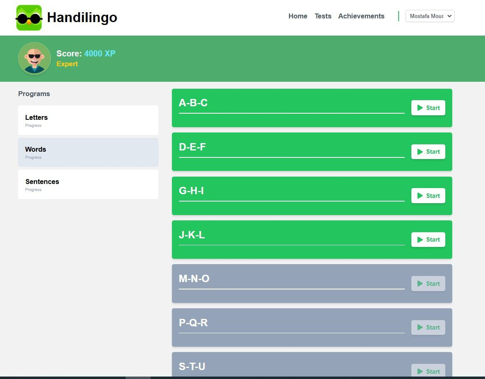
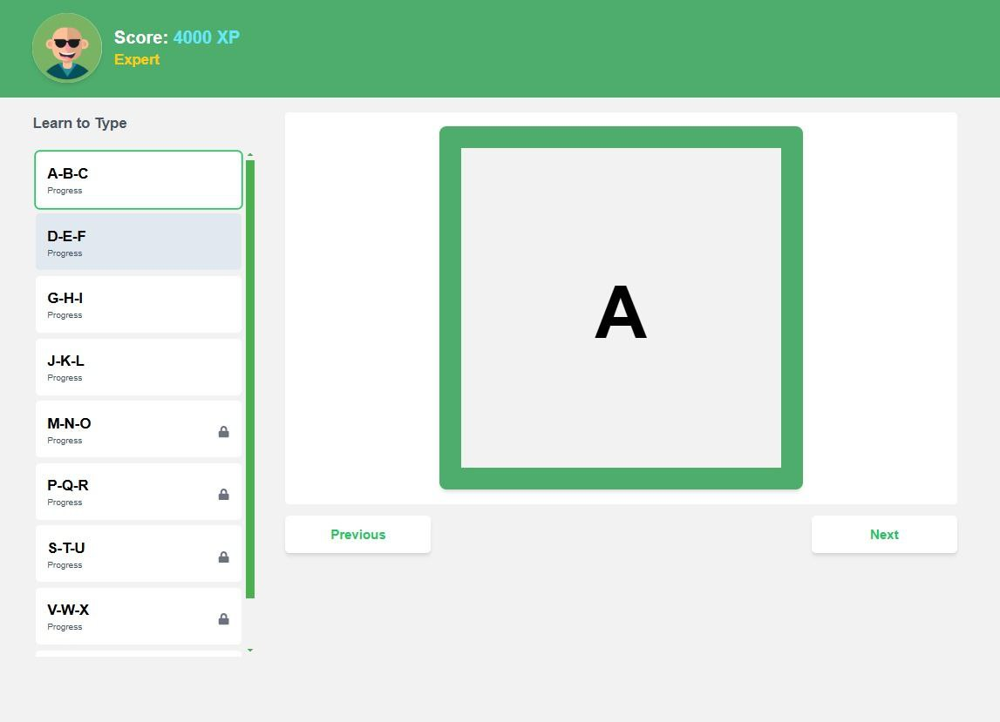
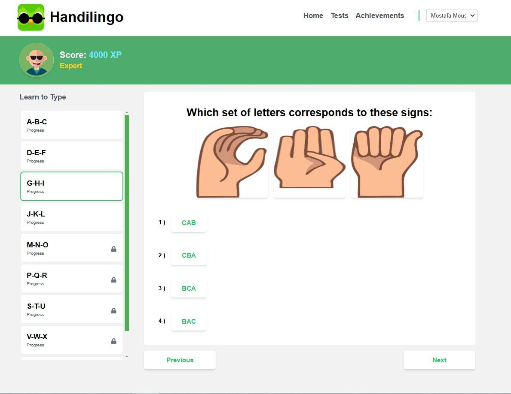
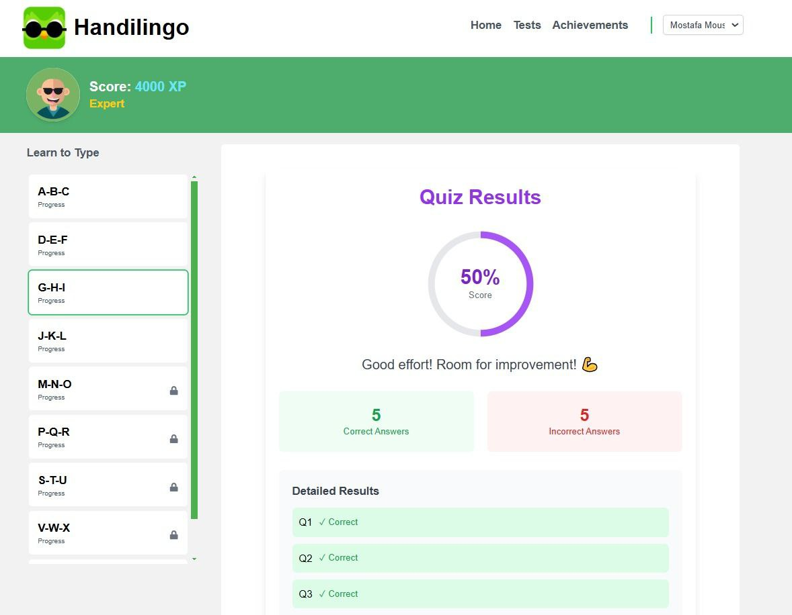

# HandiLingo

HandiLingo is a comprehensive Sign language & Braille learning platform that combines the power of Python and JavaScript to offer interactive lessons and a seamless user experience.

## Overview
HandiLingo aims to revolutionize the language learning process by providing users with:
- Interactive lessons
- Data-driven insights
- A user-friendly interface

## Features
- **Interactive Lessons**: Engage with language lessons designed to be both educational and fun.
- **Data Analysis**: Utilize data to track and improve learning progress.
- **Quizzes**: Continuous assessments for practice.

## Repository Structure
- **backend**: Contains all the server-side code.
- **frontend**: Houses the client-side code for the user interface.
- **Data**: Includes datasets used for the language learning algorithms.

## Technologies Used
- **React**: Frontend development.
- **Flask**: Web framework used for the backend.
- **Postgres**: For data organization and storage.

## Installation
1. Clone the repository:
   ```bash
   git clone https://github.com/alizayan684/HandiLingo.git
   ```
2. Navigate to the project directory:
   ```bash
   cd HandiLingo
   ```
3. Install the dependencies:
   ```bash
   npm install
   ```

## Usage
1. Start the backend server:
   ```bash
   python run.py
   ```
2. Launch the frontend:
   ```bash
   npm start
   ```

## Pages

### Courses Page

- Display a grid or list of available courses with thumbnails and brief descriptions.
- Allow users to filter courses by level, category, or language.
- Include a prominent "Start Course" button for easy access.

### Lesson Page

- Break down lessons into manageable sections with text, images, and videos.
- Provide clear navigation options to move between lessons or modules.
- Add quizzes or practice exercises within the lesson for engagement.

### Quiz Page

- Use a variety of question types (multiple choice, true/false, drag and drop).
- Offer immediate feedback on answers to enhance learning.
- Show a progress bar to keep users motivated.

### Results Page

- Display a summary of the user's performance, highlighting strengths and areas for improvement.
- Provide detailed feedback on each question, explaining correct and incorrect answers.
- Suggest next steps or additional resources based on the user's performance.
